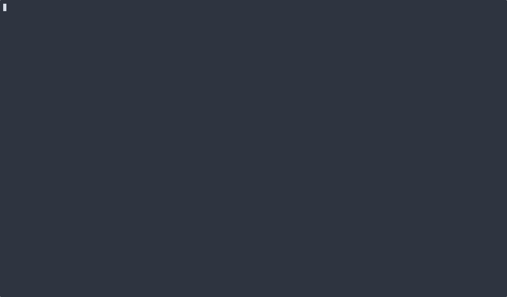

# vtx

30+ TUI widgets for [Fennel](https://fennel-lang.org/),
inspired by [gum](https://github.com/charmbracelet/gum).  Works with PUC Lua
5.2+ and LuaJIT. No C extensions required for core functionality.

[](https://github.com/mpenet/vtx/actions/workflows/ci.yml)



---

**Text input** — `input`, `num-input`, `password`, `write` (multi-line), `autocomplete`, `slider`  
**Selection** — `choose`, `radio`, `checklist`, `filter` (fuzzy/exact)  
**Prompts** — `confirm`, `dialog`, `toast`, `form`, `multi-form`, `date-picker`  
**Navigation** — `tabs`, `tree`, `file-picker`, `pager`, `viewport`  
**Progress** — `spin`, `multi-spin`, `progress`, `multi-progress`  
**Display** — `tbl`, `gauge`, `sparkline`, `style`, `hbox`, `vbox`, `separator`, gradients  
**Theming** — built-in themes, full custom theme support, 256-color + truecolor ANSI  


And more... See the full widget reference below.

---

## Contents

- [Requirements](#requirements)
- [Installation](#installation)
- [Quick start](#quick-start)
- [Style & Layout](#style--layout)
  - [`style`](#vtxstyle-text-opts)
  - [`separator`](#vtxseparator-opts)
  - [`hbox`](#vtxhbox-items-opts)
  - [`vbox`](#vtxvbox-items-opts)
  - [`place`](#vtxplace-content-opts)
  - [`key-help`](#vtxkey-help-bindings-opts)
  - [`width-of` / `height-of`](#vtxwidth-of-text--vtxheight-of-text)
  - [`merge-style`](#vtxmerge-style-base-extra)
- [Data Display](#data-display)
  - [`gauge`](#vtxgauge-value-total-opts)
  - [`sparkline`](#vtxsparkline-data-opts)
  - [Gradient utilities](#gradient-utilities)
- [Text Input](#text-input)
  - [`input`](#vtxinput-opts)
  - [`num-input`](#vtxnum-input-opts)
  - [`password`](#vtxpassword-opts)
  - [`write`](#vtxwrite-opts)
  - [`slider`](#vtxslider-opts)
  - [`autocomplete`](#vtxautocomplete-items-opts)
- [Selection](#selection)
  - [`choose`](#vtxchoose-items-opts)
  - [`checklist`](#vtxchecklist-items-opts)
  - [`radio`](#vtxradio-items-opts)
  - [`filter`](#vtxfilter-items-opts)
- [Prompts & Forms](#prompts--forms)
  - [`confirm`](#vtxconfirm-prompt-opts)
  - [`dialog`](#vtxdialog-message-buttons-opts)
  - [`toast`](#vtxtoast-message-opts)
  - [`form`](#vtxform-fields-opts)
  - [`multi-form`](#vtxmulti-form-fields-opts)
  - [`date-picker`](#vtxdate-picker-opts)
- [Navigation](#navigation)
  - [`tabs`](#vtxtabs-tab-list-opts)
  - [`tree`](#vtxtree-nodes-opts)
  - [`file-picker`](#vtxfile-picker-opts)
  - [`pager`](#vtxpager-text-opts)
  - [`viewport`](#vtxviewport-content-opts)
- [Progress & Async](#progress--async)
  - [`spin`](#vtxspin-f-opts)
  - [`multi-spin`](#vtxmulti-spin-tasks-opts)
  - [`progress`](#vtxprogress-f-opts)
  - [`multi-progress`](#vtxmulti-progress-tasks-opts)
- [Table](#table)
  - [`tbl`](#vtxtbl-headers-rows-opts)
- [Utilities](#utilities)
  - [`wrap`](#vtxwrap-text-width)
  - [Clipboard](#clipboard)
  - [Fuzzy matching](#fuzzy-matching)
- [Themes](#themes)
- [ANSI utilities](#ansi-utilities)
- [Terminal resize](#terminal-resize-sigwinch)
- [Development](#development)

---

## Requirements

- PUC Lua 5.2+ or LuaJIT (developed and tested on 5.5)
- Fennel 1.6+
- Unix terminal with `/dev/tty` and `stty`

## Installation

Clone the repo and add `fnl/` to your Fennel path, or copy the `fnl/vtx/` tree into your project.

```makefile
FENNEL_FLAGS = --add-fennel-path "fnl/?.fnl" --add-fennel-path "fnl/?/init.fnl"
```

Then require the top-level module or individual widgets:

```fennel
(local vtx (require :vtx))                        ; everything
(local {: input} (require :vtx.widget.input))      ; just input
```

## Quick start

```fennel
(local vtx (require :vtx))

(let [name (vtx.input {:prompt "Name: "})
      ok   (vtx.confirm "Continue?")]
  (when (and name ok)
    (print (.. "Hello, " name "!"))))
```

Run the bundled demo: `make demo`

---

## Widgets

All interactive widgets return `nil` if the user aborts (ctrl-c or escape where noted).  
Colors default to the active theme; pass explicit values to override.

---

## Style & Layout


### `vtx.style text opts`

Non-interactive. Renders styled/boxed text and returns the result string.

```fennel
(print (vtx.style "Hello!" {:border  "rounded"
                             :padding 1
                             :fg      vtx.ansi.fg.green
                             :bold    true}))
```

| Option | Type | Description |
|--------|------|-------------|
| `:border` | string | `"rounded"` `"normal"` `"double"` `"thick"` `"ascii"` `"none"` |
| `:padding` | number or table | Inner padding — number for all sides, or `{:top :bottom :left :right}` |
| `:margin` | number or table | Outer margin — same format as padding |
| `:width` | number | Minimum inner width (content padded to fill) |
| `:align` | string | `"left"` (default) `"center"` `"right"` |
| `:fg` | ANSI code | Text foreground color |
| `:bg` | ANSI code | Text background color |
| `:bold` | bool | Bold text |
| `:italic` | bool | Italic text |
| `:underline` | bool | Underlined text |
| `:wrap` | bool | Word-wrap text to `:width` before boxing |

Available border character sets (`vtx.borders`):

```
rounded  ╭─╮  double  ╔═╗  thick  ┏━┓  normal  ┌─┐  ascii  +-+
         │ │          ║ ║         ┃ ┃           │ │          | |
         ╰─╯          ╚═╝         ┗━┛           └─┘          +-+
```

---

### `vtx.separator opts`

Returns a horizontal rule string — a full-width line, optionally with a centered label.

```fennel
(print (vtx.separator {:width 60}))
(print (vtx.separator {:label " Section " :width 60 :border "double" :fg vtx.ansi.fg.cyan}))
```

| Option | Default | Description |
|--------|---------|-------------|
| `:width` | `40` | Total width of the separator line |
| `:label` | `""` | Optional centered label text |
| `:border` | `"normal"` | Border character set to use for `─` glyph |
| `:fg` | — | Line color |
| `:margin-left` | `0` | Left margin spaces |

---

### `vtx.hbox items opts`

Arrange rendered strings side by side. Each item is a (possibly multi-line) string. Returns the composed string.

```fennel
(print (vtx.hbox
  [(vtx.style "Left\npanel\nthree lines" {:border "rounded" :padding 1})
   (vtx.style "Center\npanel"            {:border "rounded" :padding 1})
   (vtx.style "Right"                    {:border "rounded" :padding 1})]
  {:gap 1 :valign "bottom"}))
```

| Option | Default | Description |
|--------|---------|-------------|
| `:gap` | `0` | Spaces between columns |
| `:valign` | `"top"` | Vertical alignment: `"top"` `"center"` `"bottom"` |

---

### `vtx.vbox items opts`

Stack rendered strings vertically. Returns the composed string.

```fennel
(print (vtx.vbox
  [(vtx.style "Top panel"    {:border "rounded" :width 40})
   (vtx.style "Bottom panel" {:border "rounded" :width 40})]
  {:gap 1}))
```

| Option | Default | Description |
|--------|---------|-------------|
| `:gap` | `0` | Blank lines between rows |

---

### `vtx.place content opts`

Position content within a fixed-size area (pad or crop to fit). Returns the composed string.

```fennel
(print (vtx.place my-widget {:width 40 :height 10 :halign "center" :valign "middle"}))
```

| Option | Default | Description |
|--------|---------|-------------|
| `:width` | content width | Canvas width in columns |
| `:height` | content height | Canvas height in lines |
| `:halign` | `"left"` | Horizontal alignment: `"left"` `"center"` `"right"` |
| `:valign` | `"top"` | Vertical alignment: `"top"` `"middle"` `"bottom"` |

---

### `vtx.key-help bindings opts`

Renders a compact key binding hint string. Non-interactive.

```fennel
(print (vtx.key-help [{:key "↑↓" :desc "navigate"}
                       {:key "space" :desc "select"}
                       {:key "enter" :desc "confirm"}
                       {:key "q" :desc "quit"}]))
```

| Option | Default | Description |
|--------|---------|-------------|
| `:sep` | `"  "` | Separator between binding pairs |
| `:key-fg` | bold | Key name style |
| `:desc-fg` | dim | Description style |

---

### `vtx.width-of text` / `vtx.height-of text`

Measure rendered strings (ANSI-escape-aware).

```fennel
(vtx.width-of (vtx.style "Hello" {:border "rounded"}))  ; → number of columns
(vtx.height-of (vtx.style "Hello" {:border "rounded" :padding 1}))  ; → number of lines
```

---

### `vtx.merge-style base extra`

Shallow-merge two option tables. `extra` keys override `base` keys.

```fennel
(local themed (vtx.merge-style defaults overrides))
```

---

## Data Display


### `vtx.gauge value ?total opts`

Returns a styled progress bar string. Non-interactive.

```fennel
;; Value as ratio 0–1
(print (vtx.gauge 0.75))

;; Value as count out of total
(print (vtx.gauge 45 100 {:label "RAM" :width 20 :bar-fg vtx.ansi.fg.cyan}))
```

| Option | Default | Description |
|--------|---------|-------------|
| `:width` | `20` | Bar width in characters |
| `:label` | `""` | Label prefix shown before the bar |
| `:show-pct` | `true` | Append percentage string |
| `:fill` | `"█"` | Filled block character |
| `:empty` | `"░"` | Empty block character |
| `:bar-fg` | green | Bar fill color |

---

### `vtx.sparkline data opts`

Returns a Unicode bar-chart string for a sequence of numbers. Non-interactive.

```fennel
(print (vtx.sparkline [2 5 1 8 3 9 4 7] {:label "CPU:" :fg vtx.ansi.fg.cyan}))
```

| Option | Default | Description |
|--------|---------|-------------|
| `:label` | `""` | Label prefix |
| `:fg` | cyan | Bar color |

Uses `▁▂▃▄▅▆▇█` scaled to data min/max.

---

### Gradient utilities

Apply smooth RGB color gradients to text. Non-interactive — all return styled strings.

```fennel
;; Gradient applied per character (horizontal)
(print (vtx.gradient-text "Rainbow text" ["#ff0000" "#ffff00" "#00ff00" "#0088ff"]))

;; Gradient applied per line (vertical foreground)
(print (vtx.gradient-lines "line 1\nline 2\nline 3" ["#8b5cf6" "#ec4899"]))

;; Gradient applied per line (vertical background)
(print (vtx.gradient-bg-lines "line 1\nline 2\nline 3" ["#1e3a5f" "#0d1117"]))
```

All accept a list of 3- or 6-digit hex color stops. Colors are linearly interpolated across stops.

---

## Text Input


### `vtx.input opts`

Single-line text editor. Returns the entered string or `nil`.

```fennel
(vtx.input {:prompt      "> "
             :placeholder "type here…"
             :value       "prefilled"
             :history     ["prev1" "prev2"]
             :complete    (fn [buf] ["completion1" "completion2"])
             :on-change   (fn [buf] (print buf))})
```

| Option | Default | Description |
|--------|---------|-------------|
| `:prompt` | `"> "` | Prompt prefix |
| `:placeholder` | `""` | Dim hint shown when buffer is empty |
| `:value` | `""` | Initial buffer content |
| `:prompt-fg` | cyan | Prompt color |
| `:cursor-fg` | green | Cursor highlight color |
| `:history` | `[]` | List of previous inputs; navigate with ctrl-p/ctrl-n |
| `:complete` | `nil` | `(fn [buf] [...])` — called on each change; first prefix match shown as dim ghost text; tab accepts ghost or completes |
| `:on-change` | `nil` | `(fn [buf] ...)` — called after every buffer change |

**Keys**

| Key | Action |
|-----|--------|
| enter | Submit |
| ctrl-c | Abort |
| ←/→ ctrl-b/f | Move cursor |
| home/end ctrl-a/e | Line start/end |
| alt-f/b | Word forward/back |
| backspace/ctrl-h | Delete char back |
| delete | Delete char forward |
| ctrl-w / alt-backspace | Delete word back |
| alt-d | Delete word forward |
| ctrl-k | Kill to end of line |
| ctrl-u | Clear line |
| ctrl-y | Paste from clipboard |
| ctrl-z | Undo last edit |
| tab | Trigger `:complete` (if set) |
| ctrl-p / ctrl-n | History prev/next (if `:history` set) |

---

### `vtx.num-input opts`

Numeric input with arrow-key stepping and optional bounds. Returns a number or `nil`.

```fennel
(vtx.num-input {:prompt "Age: " :min 0 :max 120 :step 1 :value 25})

;; Decimal mode
(vtx.num-input {:prompt "Price: $" :min 0.01 :max 99.99 :step 0.25 :decimals 2 :value 1.00})
```

| Option | Default | Description |
|--------|---------|-------------|
| `:value` | `0` | Initial value |
| `:min` | `nil` | Minimum (no limit if unset) |
| `:max` | `nil` | Maximum (no limit if unset) |
| `:step` | `1` | Arrow-key increment |
| `:decimals` | `0` | Decimal places; `0` = integer mode |
| `:prompt` | `"> "` | Prompt prefix |
| `:prompt-fg` | cyan | Prompt color |
| `:value-fg` | green | Valid value color (red when out of range) |

**Keys:** ↑/k/page-up increment; ↓/j/page-down decrement; home/end jump to min/max; 0–9/-/. type directly; enter confirm; ctrl-c abort.

---

### `vtx.password opts`

Masked password input. Returns the string or `nil`.

```fennel
(vtx.password {:prompt "Password: " :mask "•"})

;; Confirm mode: prompts twice, returns nil if they don't match
(vtx.password {:confirm true :confirm-prompt "Confirm: "})
```

| Option | Default | Description |
|--------|---------|-------------|
| `:prompt` | `"> "` | Prompt prefix |
| `:mask` | `"•"` | Replacement character |
| `:confirm` | `false` | Prompt twice and verify match |
| `:confirm-prompt` | `"Confirm: "` | Second prompt (confirm mode) |
| `:prompt-fg` | cyan | Prompt color |
| `:cursor-fg` | green | Cursor color |

---

### `vtx.write opts`

Multi-line text editor. Returns the text string or `nil`.

```fennel
(vtx.write {:header    "Notes:"
             :height    8
             :value     "initial text"
             :on-change (fn [content] (print (# content) "chars"))})
```

| Option | Default | Description |
|--------|---------|-------------|
| `:height` | `6` | Visible line count |
| `:prompt` | `"  "` | Per-line left margin |
| `:header` | `nil` | Label printed above the editor |
| `:value` | `""` | Initial content |
| `:prompt-fg` | cyan | Prompt color |
| `:cursor-fg` | green | Cursor color |
| `:on-change` | `nil` | `(fn [content] ...)` called after every change |

**Keys:** all `input` keys, plus ↑/↓ between lines, enter inserts newline, ctrl-d delete forward, C-c C-c submit, C-q abort.

---

### `vtx.slider opts`

Horizontal value slider. Returns a number or `nil`.

```fennel
(vtx.slider {:prompt "Volume: " :min 0 :max 100 :step 5 :value 50})
```

| Option | Default | Description |
|--------|---------|-------------|
| `:value` | `:min` | Initial value |
| `:min` | `0` | Left-most value |
| `:max` | `100` | Right-most value |
| `:step` | `1` | Arrow-key increment |
| `:width` | `30` | Track width in characters |
| `:prompt` | `""` | Prompt prefix |
| `:filled-char` | `"━"` | Left-of-thumb track character |
| `:empty-char` | `"─"` | Right-of-thumb track character |
| `:thumb-char` | `"●"` | Thumb character |
| `:thumb-fg` | cyan | Thumb color |
| `:format-fn` | `nil` | `(fn [v] string)` — custom value label |

**Keys:** ←/h decrease; →/l increase; g jump to min; G jump to max; enter confirm; q/ctrl-c abort.

---

### `vtx.autocomplete items opts`

Inline completion dropdown — query narrows results as you type. Returns the selected string or `nil`.

```fennel
(vtx.autocomplete ["apple" "apricot" "banana"] {:height 5 :fuzzy false})
```

| Option | Default | Description |
|--------|---------|-------------|
| `:height` | `5` | Max dropdown rows |
| `:fuzzy` | `false` | Fuzzy match (false = substring) |
| `:prompt` | `"> "` | Input prompt |
| `:prompt-fg` | cyan | Prompt color |
| `:cursor-fg` | cyan | Highlighted item color |

---

## Selection


### `vtx.choose items opts`

Pick one item from a list (or multiple in multi mode). Returns the selected item or a list in multi mode.

```fennel
(vtx.choose ["Fennel" "Clojure" "Lua"])
(vtx.choose items {:height 8 :multi true})
(vtx.choose items {:search true})   ; enable / search
```

| Option | Default | Description |
|--------|---------|-------------|
| `:height` | `10` | Max visible rows |
| `:multi` | `false` | Enable multi-select (space to toggle) |
| `:search` | `false` | Enable `/` incremental search |
| `:alt-screen` | `false` | Use alternate screen buffer |
| `:cursor` | `"> "` | Cursor string |
| `:cursor-fg` | cyan | Cursor color |
| `:selected-fg` | green | Highlighted item color |
| `:selected-attr` | bold | Extra attribute on highlighted item |
| `:unselected-fg` | white | Normal item color |

**Keys:** ↑/↓ k/j move; g/G first/last; space toggle (multi); / search; n/N next/prev match; enter confirm; q/ctrl-c abort.

---

### `vtx.checklist items opts`

List with toggle checkboxes. Returns a list of checked item strings, or `nil`.

```fennel
(vtx.checklist ["Option A" "Option B" "Option C"])
(vtx.checklist items {:checked [1 3] :height 8})
```

| Option | Default | Description |
|--------|---------|-------------|
| `:height` | `10` | Max visible rows |
| `:checked` | `[]` | 1-based indices to pre-check |
| `:cursor` | `"> "` | Cursor string |
| `:cursor-fg` | cyan | Cursor color |
| `:selected-fg` | green | Checked item color |
| `:unselected-fg` | white | Unchecked item color |

**Keys:** ↑/↓ k/j move; g/G first/last; space toggle; a toggle all; enter confirm; q/ctrl-c abort.

---

### `vtx.radio items opts`

Single-select radio list — cursor and selected state are decoupled so you can navigate without losing selection. Returns the selected item or `nil`.

```fennel
(vtx.radio ["Small" "Medium" "Large"])
(vtx.radio items {:prompt "Size:" :value "Medium" :height 6})
```

| Option | Default | Description |
|--------|---------|-------------|
| `:height` | item count | Max visible rows |
| `:prompt` | `nil` | Label shown above the list |
| `:value` | `nil` | Pre-selected item value |
| `:cursor-fg` | cyan | Cursor color |
| `:selected-fg` | green | Selected bullet color |
| `:unselected-fg` | white | Unselected item color |

**Keys:** ↑/↓ k/j ctrl-p/n move; g/G first/last; space select; enter confirm (returns selected, or cursor item if none selected); q/ctrl-c abort.

---

### `vtx.filter items opts`

Incremental fuzzy or substring search. Returns `[item, ...]` or `nil`.

```fennel
(vtx.filter files {:fuzzy true :height 10})
(vtx.filter items {:multi true :prompt "search: "})

;; Custom renderer — receives item string + matched byte positions
(vtx.filter items {:render (fn [item positions] (.. "[" item "]"))})
```

| Option | Default | Description |
|--------|---------|-------------|
| `:height` | `10` | Max visible rows |
| `:fuzzy` | `true` | Fuzzy match (false = substring) |
| `:multi` | `false` | Enable multi-select |
| `:alt-screen` | `false` | Use alternate screen buffer |
| `:prompt` | `"> "` | Search prompt |
| `:prompt-fg` | cyan | Prompt color |
| `:cursor-fg` | cyan | Cursor color |
| `:match-fg` | yellow | Matched char highlight |
| `:selected-fg` | green | Highlighted item color |
| `:render` | `nil` | `(fn [item positions] string)` — custom item renderer |

**Keys:** type to filter; ↑/↓ move; tab toggle (multi); enter confirm; backspace delete; ctrl-u clear; ctrl-c/escape abort.

---

## Prompts & Forms


### `vtx.confirm prompt opts`

Yes/No prompt. Returns `true`, `false`, or `nil`.

```fennel
(vtx.confirm "Delete file?")
(vtx.confirm "Overwrite?" {:default false :affirmative "Yep" :negative "Nope"})
```

| Option | Default | Description |
|--------|---------|-------------|
| `:default` | `true` | Which option starts selected |
| `:affirmative` | `"Yes"` | Truthy choice label |
| `:negative` | `"No"` | Falsy choice label |
| `:prompt-fg` | cyan | Prompt color |
| `:selected-fg` | green | Selected option color |
| `:selected-attr` | bold | Extra attribute on selected option |
| `:unselected-fg` | white | Unselected option color |

**Keys:** ←/→ h/l ctrl-b/f toggle; y confirm yes; n confirm no; enter confirm; ctrl-c abort.

---

### `vtx.dialog message buttons opts`

Styled popup box with navigable button row. Returns the 1-based index of the selected button or `nil`.

```fennel
(vtx.dialog "Are you sure?" ["Cancel" "Delete"])
(vtx.dialog "Save before closing?" ["Cancel" "Discard" "Save"]
             {:border "rounded" :width 44})
```

| Option | Default | Description |
|--------|---------|-------------|
| `:border` | `"rounded"` | Box border style |
| `:width` | `40` | Inner box width |
| `:padding` | `1` | Inner padding |
| `:fg` | white | Message text color |
| `:active-fg` | cyan | Active button color |
| `:button-sep` | `"  "` | Separator between buttons |

**Keys:** ←/→ h/l navigate buttons; tab cycle; enter confirm; q/ctrl-c/escape abort.

---

### `vtx.toast message opts`

Timed inline notification. Displays a styled message for `:timeout` seconds then clears.

```fennel
(vtx.toast "Build succeeded" {:level :success :timeout 2})
(vtx.toast "Config missing"  {:level :warn})
(vtx.toast "Connection lost" {:level :error})
(vtx.toast "Watching files…" {:level :info})
```

| Option | Default | Description |
|--------|---------|-------------|
| `:level` | `:info` | One of `:info` `:warn` `:error` `:success` |
| `:timeout` | `3` | Seconds to display |

---

### `vtx.form fields opts`

Sequential form — each field runs its own widget in sequence. Returns `{key → value}` or `nil` if any field is aborted. Fields with `:validate` are re-prompted on failure.

```fennel
(vtx.form
  [{:type     "input"
    :key      :name
    :label    "Full name"
    :opts     {:prompt "Name: "}
    :validate (fn [v] (when (= v "") "Name cannot be empty"))}
   {:type  "password" :key :pass  :label "Password" :opts {:confirm true}}
   {:type  "confirm"  :key :agree :label "Accept terms?"}
   {:type  "write"    :key :notes :label "Notes" :opts {:height 5}}
   {:type  "date"     :key :dob   :label "Date of birth"}])
```

Each field:

| Key | Description |
|-----|-------------|
| `:type` | `"input"` `"password"` `"confirm"` `"write"` `"num"` `"date"` |
| `:key` | Key in the returned map (falls back to `:label`, then position) |
| `:label` | Optional header printed before the field |
| `:opts` | Options forwarded to the underlying widget |
| `:validate` | `(fn [v] err-or-nil)` — return an error string to re-prompt |

| Form option | Default | Description |
|-------------|---------|-------------|
| `:label-fg` | cyan | Color for field labels |

---

### `vtx.multi-form fields opts`

Single-screen form — all fields visible simultaneously, tab to move between them. Returns `{key → value}` or `nil`.

Supports `"input"`, `"password"`, `"confirm"`, and `"num"` field types.

```fennel
(vtx.multi-form
  [{:type "input"   :label "Username" :key :user :opts {:value "ada"}}
   {:type "num"     :label "Age"      :key :age  :opts {:value 30 :step 1}}
   {:type "confirm" :label "Admin?"   :key :admin :opts {:default false}}
   {:type "password" :label "Token"   :key :token}])
```

| Option | Default | Description |
|--------|---------|-------------|
| `:active-fg` | cyan | Active field highlight color |
| `:label-fg` | white | Inactive label color |
| `:value-fg` | white | Inactive value color |
| `:cursor-char` | `"█"` | Inline cursor character |

**Keys:** tab advance to next field; enter on last field submits; ctrl-c/escape abort. Within fields: same editing keys as the corresponding standalone widget.

---

### `vtx.date-picker opts`

YYYY-MM-DD date selector. Returns `"YYYY-MM-DD"` or `nil`.

```fennel
(vtx.date-picker)
(vtx.date-picker {:value "2025-01-15"})
```

| Option | Default | Description |
|--------|---------|-------------|
| `:value` | today | Pre-filled date string |
| `:prompt` | `""` | Prompt prefix |
| `:active-fg` | cyan | Active segment color |
| `:inactive-fg` | white | Inactive segment color |
| `:sep` | `"-"` | Segment separator character |

Three segments (year/month/day) are navigated with tab/←/→. ↑/↓ adjust the active segment. Month/day values are clamped to valid ranges (including leap years).

**Keys:** tab/←/→ switch segment; ↑/↓ adjust; enter confirm; ctrl-c/escape abort.

---

## Navigation


### `vtx.tabs tab-list opts`

Tabbed content view. Returns the 1-based index of the active tab on enter, or `nil`.

```fennel
(vtx.tabs
  [{:label "Overview" :content "Widget library for Fennel/Lua"}
   {:label "Usage"    :content "(vtx.choose items)"}
   {:label "Config"   :content "{:height 10}"}])
```

| Option | Default | Description |
|--------|---------|-------------|
| `:active-fg` | cyan | Active tab color |
| `:inactive-fg` | dim | Inactive tab color |
| `:separator` | `"  "` | Space between tabs |

**Keys:** ←/→ h/l navigate tabs; tab cycle; 1–9 jump to tab by number; enter confirm; q/ctrl-c/escape abort.

---

### `vtx.tree nodes opts`

Collapsible tree navigator. Returns `node.data` if set, otherwise `node.label`, or `nil`.

```fennel
(vtx.tree
  [{:label "src"
    :children [{:label "main.fnl" :data "src/main.fnl"}
               {:label "util.fnl" :data "src/util.fnl"}]}
   {:label "README.md" :data "README.md"}]
  {:height 12})
```

Each node: `{:label string :children [...] :data any}`. Children make a node a directory; `:data` is the return value when selected (defaults to `:label`).

| Option | Default | Description |
|--------|---------|-------------|
| `:height` | `10` | Max visible rows |
| `:indent` | `2` | Spaces per depth level |
| `:collapsed-char` | `"▶"` | Icon for collapsed directory |
| `:expanded-char` | `"▼"` | Icon for expanded directory |
| `:leaf-char` | `"•"` | Icon for leaf node |
| `:cursor-fg` | cyan | Cursor item color |
| `:dir-fg` | blue | Directory label color |

**Keys:** ↑/↓ k/j move; →/l expand; ←/h collapse; space toggle; enter select leaf / toggle dir; g/G first/last; q/ctrl-c/escape abort.

---

### `vtx.file-picker opts`

Interactive filesystem browser. Returns the selected file path or `nil`.

```fennel
(vtx.file-picker {:path "." :height 12})
(vtx.file-picker {:dirs-only true :show-hidden true})
```

| Option | Default | Description |
|--------|---------|-------------|
| `:path` | `"."` | Starting directory |
| `:height` | `10` | Max visible rows |
| `:dirs-only` | `false` | Show only directories |
| `:show-hidden` | `false` | Show dot-files |
| `:cursor-fg` | cyan | Cursor item color |
| `:dir-fg` | blue | Directory name color |

**Keys:** ↑/↓ k/j move; enter open dir or select file; backspace/h go up; q/ctrl-c/escape abort.

---

### `vtx.pager text opts`

Scrollable text viewer with incremental search. Blocks until quit.

```fennel
(vtx.pager long-text)
(vtx.pager content {:height 30 :wrap true})
(vtx.pager code {:highlight (fn [line] (syntax-color line))})
```

| Option | Default | Description |
|--------|---------|-------------|
| `:height` | terminal rows − 1 | Visible line count |
| `:wrap` | `false` | Word-wrap lines to terminal width (toggle with `w`) |
| `:highlight` | `nil` | `(fn [line] styled-line)` — applied after search highlighting |
| `:alt-screen` | `false` | Use alternate screen buffer |

**Keys:** ↑/↓ k/j scroll line; space/ctrl-f half-page down; ctrl-b half-page up; page-up/down full page; g/G top/bottom; / search; n/N next/prev match; l toggle line numbers; w toggle wrap; q/ctrl-c quit.

---

### `vtx.viewport content opts`

Inline scrollable viewer — like `pager` but without search or alternate screen. Returns `nil`.

```fennel
(vtx.viewport long-text)
(vtx.viewport content {:height 15})
```

| Option | Default | Description |
|--------|---------|-------------|
| `:height` | `10` | Visible line count |

**Keys:** ↑/↓ k/j scroll line; page-up/down page; g/G top/bottom; q/ctrl-c/escape quit.

---

## Progress & Async


### `vtx.spin f opts`

Animated spinner while a function runs. The function runs as a coroutine; yield a string to update the title mid-run. Returns the function's return value.

```fennel
(vtx.spin
  (fn []
    (coroutine.yield "Step 1…")
    (step-1)
    (coroutine.yield "Step 2…")
    (step-2)
    "finished")
  {:title "Working…" :spinner "dots"})
```

| Option | Default | Description |
|--------|---------|-------------|
| `:title` | `""` | Text shown next to the spinner |
| `:spinner` | `"dots"` | Spinner animation name |
| `:interval` | `80` | Frame delay in milliseconds |
| `:spinner-fg` | cyan | Spinner color |

Available spinners: `"dots"` `"dots2"` `"line"` `"bounce"` `"arrow"`.

---

### `vtx.multi-spin tasks opts`

Run multiple tasks in parallel, each with its own spinner line. Returns a table of results indexed by task order.

```fennel
(vtx.multi-spin
  [{:f (fn [] (do-work) "ok")   :title "Compiling"}
   {:f (fn [] (run-tests) "ok") :title "Testing"}
   {:f (fn [] (bundle) "ok")    :title "Bundling"}])
```

Tasks run as coroutines — yield to allow other tasks to advance. A green `✓` replaces the spinner when a task finishes. Accepts the same `:spinner`, `:interval`, `:spinner-fg` opts as `spin`.

---

### `vtx.progress f opts`

Determinate or indeterminate progress bar. Calls `f` with an `update` function.

```fennel
;; Determinate
(vtx.progress
  (fn [update]
    (for [i 1 100]
      (update i 100)
      (process-item i)))
  {:title "Processing…" :width 40})

;; Indeterminate
(vtx.progress
  (fn [update] (while (not done?) (update) (do-chunk)))
  {:indeterminate true :title "Working…"})

;; With ETA and transfer rate
(vtx.progress
  (fn [update]
    (for [i 1 total]
      (update (* i chunk-size) total-bytes)
      (download-chunk i)))
  {:title "Downloading…" :show-eta true :show-rate true :unit "B"})
```

| Option | Default | Description |
|--------|---------|-------------|
| `:title` | `""` | Label shown after the bar |
| `:width` | `40` | Bar width in characters |
| `:indeterminate` | `false` | Bounce animation instead of fill |
| `:show-eta` | `false` | Show estimated time remaining |
| `:show-rate` | `false` | Show throughput rate |
| `:unit` | `nil` | Unit string; `"B"` enables KB/MB auto-scaling |
| `:fill` | `"█"` | Filled block character |
| `:empty` | `"░"` | Empty block character |
| `:block-size` | `4` | Bounce block width (indeterminate) |
| `:bar-fg` | green | Bar color |

---

### `vtx.multi-progress tasks opts`

Stacked progress bars for parallel tasks. Blocks until all complete.

```fennel
(vtx.multi-progress
  [{:f     (fn [update] (for [i 1 100] (update i 100) (process i)))
    :title "Compiling"}
   {:f     (fn [update] (for [i 1 50]  (update i 50)  (run-test i)))
    :title "Running tests"}])
```

Each task is `{:f fn :title string}` where `f` receives `(update value total)`. A green `✓` marks each bar when done. Accepts the same `:fill`, `:empty`, `:bar-fg`, `:width`, `:interval` opts as `progress`.

---

## Table


### `vtx.tbl headers rows opts`

Scrollable table with optional row selection and column sort. Returns the selected row (as an array) or `nil`.

```fennel
(vtx.tbl
  ["Name" "Age" "City"]
  [["Alice" "30" "NYC"]
   ["Bob"   "25" "LA"]]
  {:height 10 :select true})
```

| Option | Default | Description |
|--------|---------|-------------|
| `:height` | `10` | Max visible rows |
| `:select` | `true` | Enable row selection |
| `:sep` | `"  "` | Column separator string |
| `:header-fg` | cyan | Header row color |
| `:selected-fg` | green | Highlighted row color |
| `:sort-col` | `nil` | Initial sort column index |
| `:sort-asc` | `true` | Initial sort direction |

**Keys:** ↑/↓ k/j move; g/G first/last; `<`/`>` sort by prev/next column; `s` reverse sort; `0` clear sort; enter select row; q/ctrl-c quit.

Column sort is numeric-aware: columns where all visible values parse as numbers sort numerically.

---

## Utilities

### `vtx.wrap text width`

Word-wrap text to a maximum column width. Returns the wrapped string.

```fennel
(print (vtx.wrap "A very long sentence that needs wrapping." 40))
```

---

### Clipboard

```fennel
(vtx.clipboard-copy "text to copy")
(local text (vtx.clipboard-paste))   ; returns string or nil
```

Uses `pbcopy`/`pbpaste` on macOS, `xclip` or `xsel` on Linux. No error is raised if none are available.

---

### Fuzzy matching

The filter widget's matching functions are also exported:

```fennel
;; Returns a list of matched byte positions, or nil
(vtx.fuzzy-match "hello world" "hlo")   ; → {1 3 5}

;; Filter a list of strings
;; Returns [{:i orig-index :item string :positions [...]}]
(local filter-m (require :vtx.widget.filter))
(filter-m.filter-items items query fuzzy?)
```

---

## Themes

Apply a built-in theme or supply a custom color table. Themes control the default colors of all interactive widgets.

```fennel
(vtx.set-theme "nord")      ; built-in: default, nord, dracula, gruvbox, light
(vtx.set-theme {})          ; reset to no theme
(vtx.set-theme              ; custom
  {:cursor-fg   (vtx.ansi.fg256 214)
   :prompt-fg   (vtx.ansi.fg256 208)
   :selected-fg (vtx.ansi.fg256 142)
   :match-fg    (vtx.ansi.fg256 229)})
```

Theme keys (all optional):

| Key | Widgets affected |
|-----|-----------------|
| `:cursor-fg` | choose, filter, input, password, write, autocomplete |
| `:prompt-fg` | filter, input, password, write, confirm, autocomplete |
| `:selected-fg` | choose, filter, confirm, table, radio, checklist |
| `:selected-attr` | choose, filter, confirm |
| `:unselected-fg` | choose, filter, confirm, radio, checklist |
| `:match-fg` | filter |
| `:header-fg` | table |
| `:label-fg` | form, multi-form |
| `:spinner-fg` | spin, multi-spin |
| `:bar-fg` | progress, gauge |
| `:active-fg` | dialog, multi-form, date-picker, tabs |

Per-widget options always take precedence over the theme.

---

## ANSI utilities

`vtx.ansi` exposes all escape sequences directly.

```fennel
(local ansi vtx.ansi)

;; Attributes
ansi.bold  ansi.dim  ansi.italic  ansi.underline
ansi.blink ansi.reverse ansi.hidden ansi.strikethrough
ansi.reset

;; Standard foreground colors
ansi.fg.black   ansi.fg.red     ansi.fg.green  ansi.fg.yellow
ansi.fg.blue    ansi.fg.magenta ansi.fg.cyan   ansi.fg.white
ansi.fg.default

;; Bright variants
ansi.fg.bright-red   ansi.fg.bright-green  ;; etc.

;; Background colors (same names under ansi.bg.*)
ansi.bg.red  ansi.bg.blue  ;; etc.

;; 256-color and true-color
(ansi.fg256 196)          ; → "\027[38;5;196m"
(ansi.bg256 24)           ; → "\027[48;5;24m"
(ansi.fg-rgb 255 128 0)   ; → "\027[38;2;255;128;0m"
(ansi.bg-rgb 0 0 0)

;; Apply styles to a string
(ansi.style "text" ansi.bold ansi.fg.green)   ; → styled string
(ansi.strip styled-string)                     ; → plain string
(ansi.len  styled-string)                      ; → visual width (UTF-8 / wide-char aware)

;; Cursor movement
ansi.cursor.hide  ansi.cursor.show
ansi.cursor.save  ansi.cursor.restore
(ansi.cursor.up n)     (ansi.cursor.down n)
(ansi.cursor.left n)   (ansi.cursor.right n)
(ansi.cursor.col n)    (ansi.cursor.pos row col)

;; Screen
ansi.screen.clear        ansi.screen.home
ansi.screen.clear-line   ansi.screen.clear-right  ansi.screen.clear-left
ansi.screen.alt-on       ansi.screen.alt-off
```

`NO_COLOR` / `NO_COLOUR` environment variables are respected: `ansi.style` returns unstyled text when either is set.

---

## Terminal resize (SIGWINCH)

The pager responds to terminal resize automatically. Other widgets re-query the terminal size on each render. For resize support, build the optional native extension:

```sh
make compile-native   # compiles src/vtx_posix_native.c → vtx/posix_native.so
```

The extension is loaded at runtime with a graceful fallback. Without it, resize is detected on the next key event via `stty size`.

---

## License

[Mozilla Public License 2.0](LICENSE)

---

## Development

```sh
make test            # run test suite (requires fennel + faith vendored in fnl/)
make demo            # run the interactive demo
make compile         # compile all .fnl → lua/
make compile-native  # build SIGWINCH C extension → vtx/posix_native.so
make repl            # start a Fennel REPL with the correct path
bash docs/record.sh  # regenerate showcase GIFs (requires asciinema + agg)
```

Tests live in `fnl/vtx/test/`, one file per module. The test runner is `test.fnl` using [faith](https://git.sr.ht/~technomancy/faith) (vendored at `fnl/faith.fnl`).
